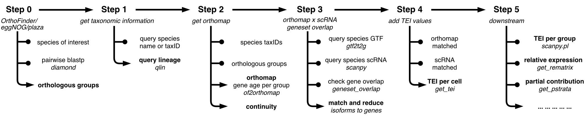

.. _tutorial:

Tutorials
=========

This section contains a variety of tutorials that should help get you started
with the `orthomap` package.

Getting started
---------------

If you are running `orthomap` for the first time, we recommend to either follow the individual `orthomap` steps
or getting started with the :doc:`nematode case study <nematode_example>` which covers all essential steps.

What the tutorials cover - Table of Contents
--------------------------------------------

.. toctree::
   :caption: pre-calculated orthomaps
   :maxdepth: 1

.. toctree::
   :caption: orthomap - steps
   :maxdepth: 1

   orthofinder
   query_lineage
   get_orthomap
   geneset_overlap
   add_tei

.. toctree::
   :caption: orthomap - downstream analysis
   :maxdepth: 1

   plotting
   relative_expression
   pstrata

.. toctree::
   :caption: case studies
   :maxdepth: 1

   nematode_example
   zebrafish_example
   frog_example
   mouse_example
   hydra_example

.. toctree::
   :caption: command line
   :maxdepth: 1

   commandline.cds2aa
   commandline.gtf2t2g
   commandline.ncbitax
   commandline.of2orthomap
   commandline.plaza2orthomap
   commandline.qlin

.. toctree::
   :caption: myTAI - function correspondance
   :maxdepth: 1

   mytai

pre-calculated orthomaps
------------------------

In addition to extract gene age classes from `OrthoFinder <https:https://github.com/davidemms/OrthoFinder>`_ results,
`orthomap` has the functionality to parse and extract gene age classes from pre-calculated orthologous group databases,
like `eggNOG <http://eggnog6.embl.de/#/app/home>`_ or
`plaza <https://bioinformatics.psb.ugent.be/plaza/>`_.

If your query species is part of one of these databases, it might be sufficient to use the gene age classes directly
from them and not start the time consuming step of orthologous group detection with `OrthoFinder <https:https://github.com/davidemms/OrthoFinder>`_
or any other related tool (see benchmark of tools at `Quest for Orthologs <https://orthology.benchmarkservice.org/proxy/>`_).

.. note::
   Since gene age class assignment for any query species relies on taxonomic sampling to cover at best all possible
   species tree nodes from the root (origin of life) up to the query species, the pre-calculated orthologous group databases
   might lack species information for certain tree nodes. Orthologous group detection algorithm do not account for missing species
   and as such will influence the taxonomic completeness score.

.. note::
   To link gene age classes and expression data one should use the same genome annotation version for both,
   the orthologous group detection and the gene expression counting. To use the same genome annotation has the benefit
   not to miss any gene in one or the other and decreases the source of error during gene ID mapping.

- :doc:`eggnog2orthomap`: This tutorial introduces how to run your own OrthoFinder analysis.
- :doc:`plaza2orthomap`: This tutorial introduces how to run your own OrthoFinder analysis.

orthomap - steps
----------------

- overview picture goes here

This section contains the main steps of `orthomap` to extract gene age information for a query species up to linking
the extracted gene age classes and expression data of single-cell data sets.

- :doc:`orthofinder`: This tutorial introduces how to run your own OrthoFinder analysis.
- :doc:`query_lineage`: This tutorial introduces how to get taxonomic information.
- :doc:`get_orthomap`: This tutorial introduces how to extract an orthomap (gene age class) from OrthoFinder results.
- :doc:`geneset_overlap`: This tutorial introduces how to match gene or transcript IDs between an orthomap and scRNA data.
- :doc:`add_tei`: This tutorial introduces how to add a transcriptome evolutionary index (short: TEI) to scRNA data.

orthomap - downstream analysis (step 5)
---------------------------------------

- :doc:`plotting`: This tutorial introduces some basic concepts of plotting results.
- :doc:`relative_expression`: This tutorial introduces relative expression per gene age class and its contribution to the global TEI per cell or cell type.
- :doc:`pstrata`: This tutorial introduces partial TEI and its contribution to the global TEI per cell or cell type.

case studies
------------

- :doc:`nematode_example`: This notebook covers a re-analysis of nematode (Caenorhabditis elegans) scRNA data.
- :doc:`zebrafish_example`: This notebook covers a re-analysis of zebrafish (Danio rerio) scRNA data.
- :doc:`frog_example`: This notebook covers a re-analysis of frog (Xenopus tropicalis) scRNA data.
- :doc:`mouse_example`: This notebook covers a re-analysis of mouse (Mus musculus) scRNA data.
- :doc:`hydra_example`: This notebook covers a re-analysis of hydra (Hydra vulgaris) scRNA data.

command line
------------

- :doc:`commandline`: This tutorial covers which orthomap functions can be run via the command line.

myTAI - function correspondance
-------------------------------

- :doc:`mytai`: This tutorial covers which orthomap functions correspond to myTAI functions.

.. note::
   A demo dataset is available for each of the tutorial notebooks above.
   These datasets allow you to begin exploring `orthomap` even if you do not have any data at any step in the analysis
   pipeline.

Prerequisites
-------------

- This tutorial assumes that you have basic **Python programming experience**.
  In particular, we assume you are familiar with using a notebook from the following python data science libraries:
  **jupyter**.
- To better understand plotting and data access, the user should try to get familiar with the python libraries:
  **pandas**, **matplotlib** and **seaborn**.
- `orthomap` is a python package but part of it can be run on the command line. For the installation of `orthomap`,
  we recommend using `Anaconda <https://anaconda.org>`_
  (`see here <https://orthomap.readthedocs.io/en/latest/installation/index.html>`_).
  If you are not familiar with Anaconda or python environment management,
  please use `our pre-built docker image <https://orthomap.readthedocs.io/en/latest/installation/index.html#docker-image>`_.

Code and data availability
--------------------------

- We provide links for the notebook in each section.

- You can download the demo input data using `orthomap` data loading function in the notebooks.
  `see here <https://orthomap.readthedocs.io/en/latest/modules/orthomap.html#modules-for-dataset-downloads>`_)

